<div align="center">

</div>

<br/>



## 🧠 About Me

```yaml
name        : Santhosh Shandeep  (Santho)
role        : AI Automation Expert & Full-Stack Developer
company     : Founder @ Zen4trix AI Automation  🏢
location    : Tirupur, Tamil Nadu, India  📍
languages   : Tamil | English | Code  💬
msme        : UDYAM-TN-28-0213819  ✅
currently   : Building EduZen — College Campus SaaS  🎓
open_to     : AI Projects · Automation Consulting · Collabs
```

<br clear="right"/>

---

## 🚀 What I Build

| Service | Description |
|--------|-------------|
| 🤖 **WhatsApp AI Bots** | Auto-replies, order tracking, 24/7 customer support |
| 🧾 **Auto Invoicing** | Instant smart billing for textile & SME businesses |
| 📅 **Appointment Systems** | WhatsApp-based smart scheduling bots |
| 🌐 **Business Websites** | Fast, modern, SEO-ready sites for local businesses |
| 🎓 **EduZen SaaS** | College campus management platform *(launching soon)* |
| 📝 **ai360tamil Blog** | Tamil-language AI education & tutorials |

---

## 🛠 Tech Stack

<div align="center">


</div>

---

## 🏅 Expertise Level

<div align="center">


</div>

---

## 📊 GitHub Stats

<div align="center">


</div>

---

## 🌟 Featured Projects

| Project | Description | Status |
|---------|-------------|--------|
| 🎓 [EduZen](https://github.com/santhoshshandeep) | College Campus Management SaaS | 🔨 Building |
| 🤖 [Zen4trix](https://zen4trix.in) | AI Automation Agency | ✅ Live |
| 📝 [ai360tamil](https://ai360tamil.blogspot.com) | Tamil AI Education Blog | ✅ Live |

---

## 🐍 Contribution Snake

<div align="center">

<picture>
  <source media="(prefers-color-scheme: dark)" srcset="https://raw.githubusercontent.com/santhoshshandeep/santhoshshandeep/output/github-contribution-grid-snake-dark.svg"/>
  <source media="(prefers-color-scheme: light)" srcset="https://raw.githubusercontent.com/santhoshshandeep/santhoshshandeep/output/github-contribution-grid-snake.svg"/>
  
</picture>

</div>

---

## 🎯 Current Mission

```
🎓  EduZen SaaS  →  Free pilot @ Tirupur colleges → Paid SaaS
🤖  Zen4trix     →  Scaling AI bots for 50+ Tamil Nadu SMEs
📝  ai360tamil   →  Making AI accessible in Tamil
```

> *"AI automation is not the future — it's the now. Building it for Tamil Nadu."*

---

## 🛰 Let's Connect

<div align="center">

[](https://zen4trix.in)
[](https://ai360tamil.blogspot.com)
[](https://linkedin.com/in/santhoshshandeep)
[](https://instagram.com/zen4trix)
[](mailto:hello@zen4trix.in)

</div>

---

<div align="center">


</div>
